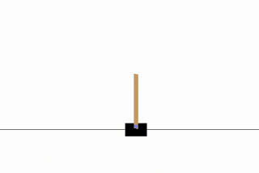

# DENet

These are examples of neural network architectures built using [PyTorch](https://pytorch.org/) designed to use [DE (Differential Evolution)](https://en.wikipedia.org/wiki/Differential_evolution) rather than gradient descent for updating weights. It's designed to be testable using [OpenAI Gym RL (reinforcement learning) environments](https://gym.openai.com/docs/).

It relies a custom pip package called [devo](https://github.com/omardelarosa/Adaptive-DEs) which is a fork of [gzjj05/Adaptive-DEs](https://github.com/gzjj05/Adaptive-DEs).

## Installation

It's recommended you use `pipenv` and `pyenv` for this project to ensure dependecies match.

```bash
pipenv install
pipenv shell
```

## Usage

It's recommended to begin with `CartPole-v0` example, since results vary wildly with other environments.

```
usage: de-net.py [-h] [--save-model] [--steps STEPS] [--episodes EPISODES]
                 [--load-model] [--optimizer-name OPTIMIZER_NAME]
                 [--log-level LOG_LEVEL] [--maximize] [--should-test]
                 [--env-name ENV_NAME] [--from-file FROM_FILE]
                 [--crossover-rate CROSSOVER_RATE]
                 [--scaling-factor SCALING_FACTOR]
                 [--population-size POPULATION_SIZE] [--batch-size BATCH_SIZE]
                 [--reward-reducer REWARD_REDUCER]
                 [--hidden-layer-size HIDDEN_LAYER_SIZE]
                 [--recycle-population]

PyTorch Adaptive-DEs Example

optional arguments:
  -h, --help            show this help message and exit
  --save-model          For Saving the current Model
  --steps STEPS         Steps per episode (default: 300)
  --episodes EPISODES   Number of episodes per objective functtion run
                        (default: 1000)
  --load-model          Load from saved model
  --optimizer-name OPTIMIZER_NAME
                        Choose a devo Adaptive-DE optimizer (['DE', 'jDE',
                        'SHADE', 'LSHADE', 'JADE', 'CoDE'])
  --log-level LOG_LEVEL
                        Set log level (default: 1)
  --maximize            Maximize rather than minimize (default: False)
  --should-test         Should run a test at the end of training (default:
                        True)
  --env-name ENV_NAME   OpenAI Gym environment to use (default: CartPole-v0)
  --from-file FROM_FILE
                        Choose file name for loading/saving (default: data/de-
                        nn-model.pt)
  --crossover-rate CROSSOVER_RATE
                        Choose crossover rate for devo optimizer (default:
                        0.1)
  --scaling-factor SCALING_FACTOR
                        Choose scaling factor for devo optimizer (default:
                        0.1)
  --population-size POPULATION_SIZE
                        Choose population size for devo optimizer (default:
                        30)
  --batch-size BATCH_SIZE
                        Choose batch size of actions during episode (default:
                        40)
  --reward-reducer REWARD_REDUCER
                        Reducer function for episode rewards (default: sum,
                        options: ['sum', 'mean', 'max', 'time_scaled_sum',
                        'time_scaled_mean'])
  --hidden-layer-size HIDDEN_LAYER_SIZE
                        Choose hidden layer size of actions during episode
                        (default: 40)
  --recycle-population  Recycles population each generation and uses it as
                        input for the next generation's initial population
                        (default: False)
```

## Examples



So far my best performing `CartPole-v0` model was generated using the following hyperparameters:

```
python de-net.py --steps=1000 --episodes=5000 --should-test --optimizer-name=DE --population-size=30 --batch-size=50
```

This can executed and loaded using:

```
python de-net.py --steps=1000 --episodes=5000 --should-test --optimizer-name=DE --population-size=30 --batch-size=50 --from-file=saved_models/DE_s1000_e5000_CartPole-v0_p30_b50_reward_sum --load-model
```
